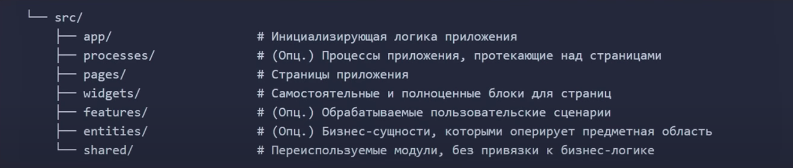

# Front-end архитектура Platforma-exe.ru
<hr>


## Разделы

- [FSD архитекртура](#Архитектура-приложения)

## Архитектура приложения (FSD)

### <u>Основы</u> 

Проект на FSD состоит из слоев (layers), каждый слой состоит из слайсов (slices) и каждый слайс состоит из сегментов (segments).


<b>Слои</b> стандартизированы во всех проектах и расположены вертикально. Модули на одном слое могут взаимодействовать лишь с модулями, находящимися на слоях строго ниже. На данный момент слоев семь (снизу вверх):

- `shared` — переиспользуемый код, не имеющий отношения к специфике приложения/бизнеса.(например, UIKit, libs, API)
- `entities` (сущности) — бизнес-сущности.(например, User, Product, Order)
- `features` (фичи) — взаимодействия с пользователем, действия, которые несут бизнес-ценность для пользователя.(например, SendComment, AddToCart, UsersSearch)
- `widgets` (виджеты) — композиционный слой для соединения сущностей и фич в самостоятельные блоки(например, IssuesList, UserProfile).
- `pages` (страницы) — композиционный слой для сборки полноценных страниц из сущностей, фич и виджетов.
- `processes` (процессы, устаревший слой) — сложные сценарии, покрывающие несколько страниц.(например, авторизация)
- `app` — настройки, стили и провайдеры для всего приложения.


Затем есть слайсы, разделяющие код по предметной области. Они группируют логически связанные модули, что облегчает навигацию по кодовой базе. Слайсы не могут использовать другие слайсы на том же слое, что обеспечивает высокий уровень связности (cohesion) при низком уровне зацепления (coupling).

В свою очередь, каждый слайс состоит из сегментов. Это маленькие модули, главная задача которых — разделить код внутри слайса по техническому назначению. Самые распространенные сегменты — 
- `ui` - компоненты пользовательского интерфейса, функции форматирования данных
- `model` - бизнес-логика и хранилища данных, функции для обработки этих данных
- `lib` - вспомогательный инфраструктурный код
- `api` - взаимодействие с внешними API, API-методы бэкенда

|Слой|ui|model|lib|api|
|--|--|--|--|--|
|Shared|UI-библиотека|Обычно не используется|Утилитарные модули из нескольких связанных файлов.Если вам нужны индивидуальные вспомогательные функции, обратите внимание на библиотеки утилит, например, lodash-es.|Примитивный API-клиент с дополнительными функциями, такими как аутентификация или кэширование.|
|Entities|Скелет бизнес-сущности со слотами для интерактивных элементов|Хранилище объектов этой сущности, а также функции для обработки этих объектов.Этот сегмент лучше всего подходит для хранения данных с сервера. Если вы используете TanStack Query или другие методы неявного хранения, вы можете опустить этот сегмент.|Функции над объектами этой сущности, не связанные с хранением данных|API-методы, использующие API-клиент из Shared для упрощения коммуникации с бэкендом|
|Features |Интерактивные элементы, позволяющие пользователям использовать эту функцию | Бизнес-логика и хранилище инфраструктурных данных, если требуется (например, текущая тема приложения). Здесь лежит код, который непосредственно создает пользу для пользователя|Инфраструктурный код, который позволяет сегменту model более кратко описать бизнес-логику |API-методы, представляющие эту функцию на бэкенде.Может объединять API-методы из Entities.|
|Widgets |Композиция Entities и Features в самодостаточные блоки интерфейса.Также может содержать ограничители ошибок и состояния загрузки. |Хранилище инфраструктурных данных, если требуется |Не-бизнес-взаимодействия (например, жесты) и прочий код, необходимый для функционирования этого блока на странице | Обычно не используется, но может содержать загрузчики данных в контексте вложенного роутинга (например, Remix)|
|Pages|Композиция Entities, Features и Widgets в полноценные страницыТакже может содержать ограничители ошибок и состояния загрузки.|Обычно не используется|Не-бизнес-взаимодействия (например, жесты) и прочий код, необходимый для создания полноценного пользовательского опыта на этой странице|Загрузчики данных для фреймворков, ориентированных на SSR (рендеринг на сервере)|
### <u>Публичное API модуля приложения</u> 

### Цели

Удобство использования и интеграции модуля достигается через выполнение ряда целей:

- Приложение должно быть защищено от изменений внутренней структуры отдельных модулей
- Переработка внутренней структуры модуля не должна затрагивать другие модули
- Существенные изменения поведения модуля должны быть легко определяемы
- Существенные изменения поведения модуля - изменения, ломающие ожидания сущностей-пользователей модуля.


```
└── features/                          # 
   └── auth-form/                      # Внутренняя структура фичи
            ├── ui/                    #
            ├── model/                 #
            ├── {...}/                 #
            └── index.ts               # Энтрипоинт фичи с ее публичным API
```


```
**/**/index.ts

export { Form as AuthForm } from "./ui"
export * as authFormModel from "./model"
```

### <u>Файловая структура</u> 





## Источники (Обязательно к просмотру и изучению)


- [Документация FSD](https://feature-sliced.design/ru/)
- [Краткий обзор](https://feature-sliced.design/ru/docs/get-started/overview)
    - [Слои](https://feature-sliced.design/ru/docs/reference/layers)
    - [Слайсы и сегменты](https://feature-sliced.design/ru/docs/reference/slices-segments)
    - [Public API](https://feature-sliced.design/ru/docs/reference/public-api)

- [Видео материал](https://youtu.be/c3JGBdxfYcU?t=1620)


## Ссылки


- [Архитектура](../README.md)
- [Техническая документация](../../README.md)

<p align="center">&copy; 2023 PLATFORMA.EXE</p>