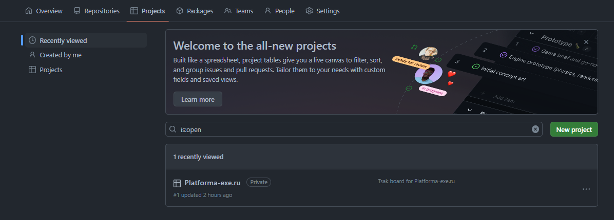
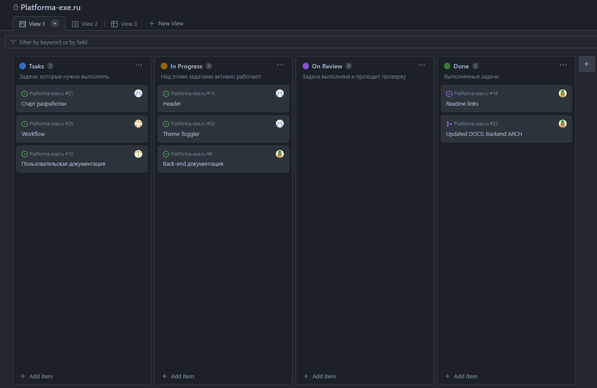
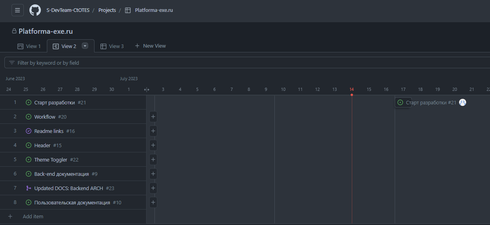
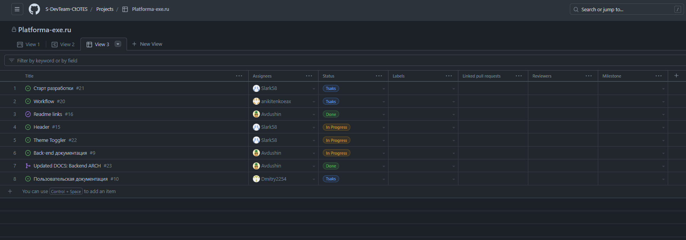

# GitHub Projects | Техническая документация Platforma-exe.ru

## Разделы

- [GitHub Projects | Техническая документация Platforma-exe.ru](#github-projects--техническая-документация-platforma-exeru)
  - [Разделы](#разделы)
    - [Что такое Gitub Projects](#что-такое-gitub-projects)
    - [Как работать с Projects?](#как-работать-с-projects)
    - [Виды представления доски задач](#виды-представления-доски-задач)
  - [Сноски](#сноски)
    - [Ревьюеры (Reviewers)](#ревьюеры-reviewers)
    - [Спринт](#спринт)
  - [Ссылки](#ссылки)

### Что такое Gitub Projects

[GitHub Projects](https://docs.github.com/en/issues/planning-and-tracking-with-projects/learning-about-projects/about-projects) - это адаптируемый, гибкий инструмент для планирования и отслеживания работы на GitHub.

Это адаптируемая электронная таблица, доска задач и дорожная карта, которые интегрируются с вашими проблемами и запросами на включение в GitHub, чтобы помочь вам эффективно планировать и отслеживать свою работу. Вы можете создавать и настраивать несколько представлений, фильтруя, сортируя, группируя свои проблемы и запросы на вытягивание, визуализируя работу с настраиваемыми диаграммами и добавляя настраиваемые поля для отслеживания метаданных, характерных для вашей команды. Вместо того, чтобы навязывать определенную методологию, проект предоставляет гибкие функции, которые вы можете настроить в соответствии с потребностями и процессами вашей команды.

### Как работать с Projects?

Для того, чтобы работать с Projects, вам необходимо перейти в раздел "Projects" и выбрать там один из проектов.

Выбирая проект, вы перенаправляетесь на доску задач. В нашем проекте, мы опираемся на представление списка задач в виде **Kanban доски**.

### Виды представления доски задач

Доска Kanban

   Доска Kanban представляет собой визуальную доску, где задачи представлены в виде колонок и карточек. Колонки обычно соответствуют этапам работы, например, "To Do", "In Progress", "Done". Вы можете перемещать карточки между колонками, отслеживая прогресс выполнения задач. В нашем случае, можно выделить такие колонки как:

   - Tasks\
    Колонка с задачами, которые нужно выполнить

   - In Progress\
    Колонка с задачами, над которыми члены команды уже работают 

   - On Rewiev\
    Задачи, которые проходит проверку. После проаерки выполнения задачи он считается выполненной.\
    Задачи проверяют [Ревьюеры*]()

   - Done\
    Выполненные задачи. Как правило, список выполненных задач очищается по окончанию [спринта*](#спринт)

  

 

  
Роудмап/Таймлайн

  Роудмап или таймлайн представляет собой графическое отображение плана разработки или списка задач на основе временной шкалы. Это помогает визуализировать хронологию и зависимости между задачами, позволяя увидеть общую картину проекта и планировать работы на будущее.

  

 

  
Табличный вид

  Табличный вид представляет задачи в виде таблицы с рядами и столбцами. Каждая строка представляет отдельную задачу, а столбцы содержат различные атрибуты и метаданные задачи, такие как статус, приоритет, ответственный и даты. Табличный вид обеспечивает удобный способ отслеживать и фильтровать задачи по различным критериям.

  

## Сноски

### Ревьюеры (Reviewers) 
Ревьюеры – это люди, назначенные для проверки и оценки кода, внесенного в ветку репозитория перед его вливанием (merge). Они играют важную роль в процессе код-ревью, который является практикой, при которой другие разработчики из команды или организации обзорщики просматривают, анализируют и комментируют код, созданный другими участниками проекта.

### Спринт

Спринт в IT-проекте – это ограниченный по времени период, обычно от одной до четырех недель, в течение которого разработчики и команда проекта работают над определенным набором задач. Концепция спринта является ключевым элементом методологии разработки программного обеспечения, известной как Scrum.

В рамках спринта команда выбирает определенное количество задач, которые они планируют выполнить за указанный период. Задачи могут включать разработку новых функций, исправление ошибок, оптимизацию кода и т. д. Команда работает над этими задачами в течение спринта, применяя коллективное усилие и следуя принципам Scrum.

В начале спринта команда проводит планирование спринта, где определяются цели, задачи и ожидаемый результат спринта. Затем команда разбивает задачи на более мелкие подзадачи и оценивает их сложность и объем работы. Каждая подзадача может быть назначена конкретным участникам команды.

В течение спринта команда проводит ежедневные совещания, называемые Daily Scrum, где каждый член команды сообщает о своих достижениях, планах и препятствиях. Это помогает всей команде быть в курсе текущего состояния проекта и координировать свои усилия.

По окончании спринта команда оценивает свои результаты и предоставляет готовую функциональность заказчику или выкладывает обновленный продукт в производство. Также проводится ретроспектива, где команда анализирует свою работу, идентифицирует успешные практики и области для улучшения.

Спринты позволяют команде работать в итеративном режиме, достигать более частых результатов и иметь возможность быстро реагировать на изменения и обратную связь. Они способствуют ускорению разработки, повышению эффективности команды и достижению целей проекта.

## Ссылки

- [Правила оформления документации](../../DOCTERMS.md)
- [Техническая документация](../../dev-docs/README.md)
- [Архитектура](../Arch/README.md)
    - [Front-end](../../dev-docs/Arch/Front-end/Front-end.md)
    - [Back-end](../../dev-docs/Arch/Back-end/Back-end.md)
  - [Git](../Git/Readme.md)
- [Пользовательская документация](../../user-docs/README.md)

&copy; 2023 PLATFORMA.EXE
